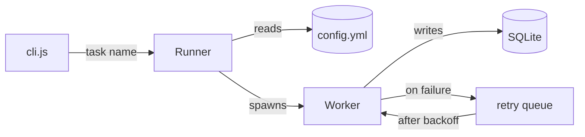
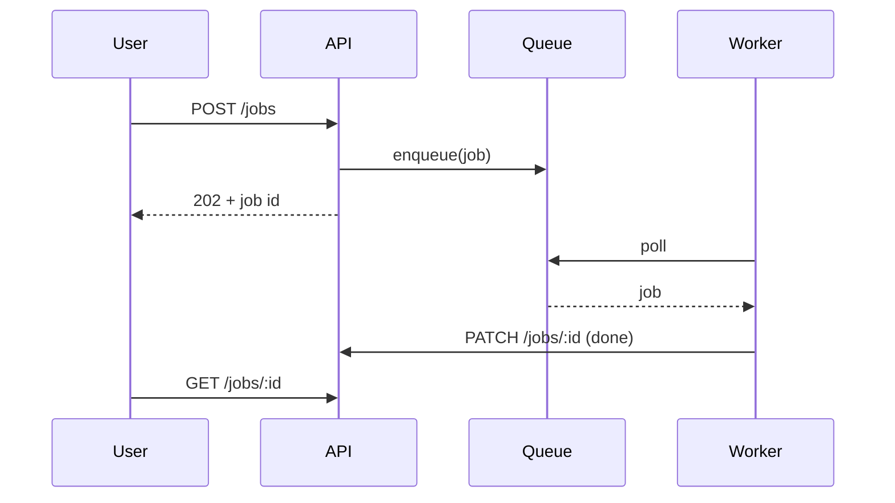
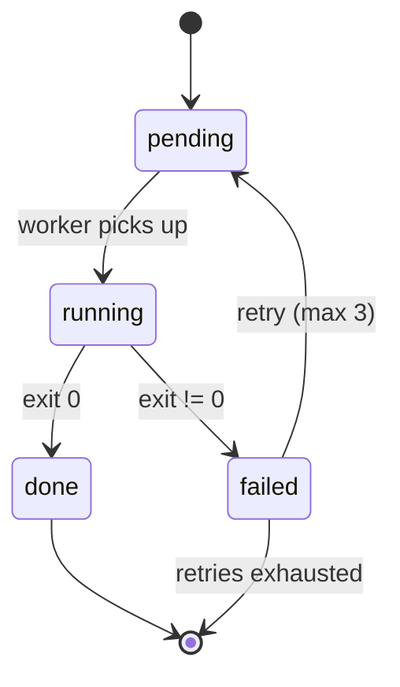
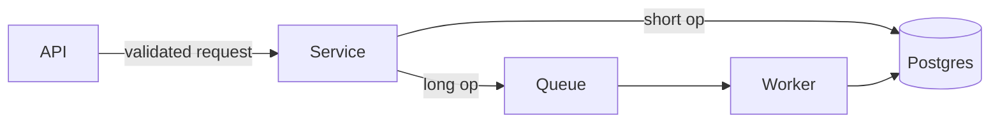

# Human-facing docs (README.md, docs/**)

## What the reader wants

Someone landing on a README has three questions, in this order, and abandons the page if the first one is not answered fast:

1. What is this?
2. Does it solve my problem?
3. How do I run it?

Everything else is reference material they come back for later. Order the document that way, even if the original was organised around how the project was built rather than how it is used.

## Shape

A workable skeleton — adapt it, do not impose it on a project it does not fit:

```
# Name
One sentence: what it does, for whom.

## Quick start        ← copy-pasteable, works from a clean clone
## How it works       ← the mental model, usually a diagram + a few lines
## Configuration      ← only the knobs people actually turn
## Common tasks       ← the 4-5 things people do weekly
## Links              ← deeper docs, issues, related projects
```

Signals the shape is wrong: install instructions below the fold, an "About the author" section before the quick start, a table of contents for a 60-line file, or three sections that all explain the architecture.

## Simplifying the prose

The goal is a reader who never has to re-read a sentence.

- **Short sentences.** One idea each. A sentence with two "and"s and a subordinate clause is two sentences.
- **Active voice.** "The server reads `config.yml`" beats "`config.yml` is read by the server."
- **Cut empty openers.** "It is important to note that", "As you may know", "In order to", "Basically", "Simply". They add length and, in the case of "simply", make a stuck reader feel stupid.
- **Define jargon once, or drop it.** Internal codenames are fine if defined on first use; otherwise use the plain word.
- **Second person for instructions.** "Run `npm install`" — not "the user should run".
- **Concrete over abstract.** Show the command and its output rather than describing what happens.
- **One idea per paragraph**, three or four lines maximum. Walls of text are skipped, not read.

Do not flatten personality. A project README with jokes in it is allowed to keep them — clarity is the goal, blandness is not.

## Diagrams

A diagram earns its place when it shows something prose makes you *reconstruct in your head*. Good candidates:

- an architecture with more than three moving parts
- a flow with branches or failure paths
- an exchange between services or processes over time
- a lifecycle with states and transitions

Bad candidates: three sequential steps (a numbered list is faster to read), a plain hierarchy of files (a code block with a tree is clearer), a single component talking to a single database.

The test: if you can replace the diagram with one sentence and lose nothing, write the sentence.

### Make it show the mechanism

A diagram of five labelled boxes with unlabelled arrows tells the reader almost nothing. Label the edges with what actually flows — the call, the payload, the trigger. Direction should be meaningful. Keep node labels to a few words.

### Patterns

**Architecture** — `flowchart`, top-down or left-right:



**Exchange over time** — `sequenceDiagram`, when the order of messages is the point:



**Lifecycle** — `stateDiagram-v2`, when the object has states and rules for moving between them:



### Syntax traps

These break rendering on GitHub and are easy to miss:

- Parentheses, brackets, colons or `/` inside a node label need quotes: `A["src/api (v2)"]` — bare `A[src/api (v2)]` fails to parse.
- `end` as a bare word in a node label breaks the parser; capitalise it or quote it.
- Edge labels use `-->|text|`, not `-->[text]`.
- `stateDiagram-v2`, not `stateDiagram` — the v1 syntax differs.
- Keep the diagram under ~15 nodes. Past that it is unreadable on a phone and should be split into two diagrams at different zoom levels.

After writing a diagram, re-read it as a stranger: can you name what each arrow does?

## Verification

A README's credibility collapses on the first command that fails. Check, against the real project:

- **every command runs as written**, from a clean clone, in the order given — including the install step
- **every path mentioned exists**
- **version numbers match the manifests** (`package.json`, `pyproject.toml`, `.nvmrc`, `Dockerfile`)
- **every URL and internal link resolves**
- **environment variables listed are the ones the code actually reads** — and none that it reads are missing
- **ports and hostnames match** what the server code and `docker-compose.yml` say

See `references/verification.md` for where to look for each.

## Before / after

**Before (11 lines):**

```markdown
## Architecture

The application is built on a modular architecture. When a request comes
in, it is first handled by the API layer, which is responsible for
validating the incoming request. After validation has been performed,
the request is then passed along to the service layer. The service layer
contains the business logic of the application and it is here that the
decision is made about what should happen next. If the operation is a
long-running one, it will be placed onto a queue so that it can be
processed asynchronously by one of the background workers. Otherwise,
the service layer will interact directly with the database.
```

**After (7 lines):**

````markdown
## How it works

The API validates the request, then hands it to the service layer. Long
operations go on a queue and are picked up by a worker; short ones hit the
database directly.


````

Same information, and the branch — the thing the paragraph made you hold in your head — is now visible at a glance.

## How far to go

Most project READMEs land between 40 and 120 lines. Beyond that, the material usually wants to be split: keep the entry point short and move the depth into `docs/`, linked from the README. Splitting is better than deleting when the content is true and useful but not what a first-time reader needs.
